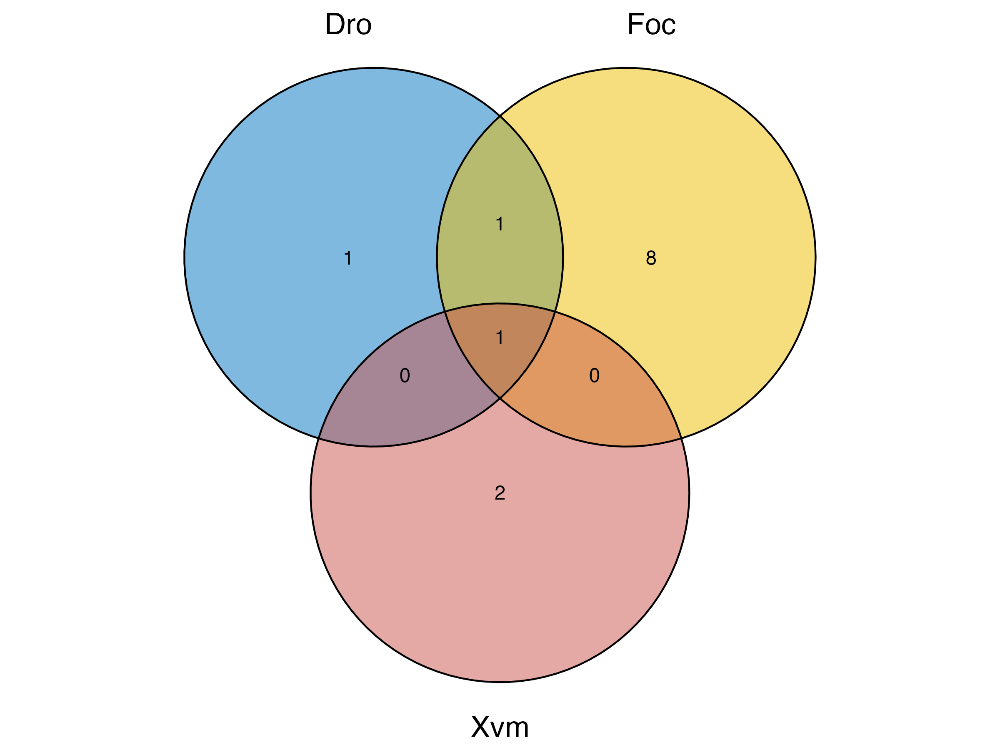

# Progress with NovDec data analysis

For all analysis I followed the protocol outlined in the [Processing Metabolomics Data protocol](https://github.com/JamiePike/UntargetedMetabolomics/blob/main/docs/ProcessingData.md).

## Overview of symptom development

Been as though we are looking at different features between treatment groups, and trying to attribute these to treatment, it is useful to have symptom development as context. Figures were generated using [`SymptomDevStats.R`](https://github.com/JamiePike/UntargetedMetabolomics/blob/main/bin/SymptomDevStats.R).

External symptom development | Internal symptom development
:---------------------------:|:------------------:
 | 

## IPO Runs

IPO was run twice for positive mode data;

- First with all samples (minus blanks)
- Then without the samples C12-2 and X12-4 (minus blanks)

Outputs can be found here:

Positive mode -> `Metabolomics/NovDec22/IPO/Pos`.

Negative mode -> `Metabolomics/NovDec22/IPO/Neg`

## XCMS Runs

### Positive mode

XCMS was run multiple times, first using the parameters from IPO, followed by changes to adjust the outputs. A summary file (displayed below) of these changes and outputs can be found; `/Metabolomics/NovDec22/XCMS/Pos/XCMS_Params.xlsx`

 Date | Directory Name | Param Summary | Treatment grouping | Feature No.| Feature No - no peaks in blanks| Features after filtering | Notes | XCMS Params ||||||||||||||||||||||||||||
|---|---|---|---|---|---|---|---|---|---|---|---|---|---|---|---|---|---|---|---|---|---|---|---|---|---|---|---|---|---|---|---|---|---|---|---
||||||||| method | peakwidth    | ppm   | noise | snthresh | mzdiff   | prefilter | mzCenterFun | integrate | fitgauss | verbose.columns | method  | plottype | distFunc | profStep | center   | response | gapInit | gapExtend | factorDiag | factorGap | localAlignment | method  | bw      | mzwid  | minfrac | minsamp | max |
| 04/10/2023 | 01_IPO_Basic_041023 | IPO deafult output for this data set| Separated by time and treatment | 1895        | 378         |      | A lot of features also identified in the Blank samples      | centWave    | c(40, 84.5), | 47    | 1000  | 10       | -0.00815 | c(3,100)  | wMean       | 1         | FALSE    | FLASE | obiwarp | none     | cor_opt  | 1        | 47       | 1        | 0.32    | 2.7       | 2| 1         | 0    | density | 0.879999999999999 | 0.0265 | 1       | 1       | 50  |
| 05/10/2023 | 02_IPO_Basic_DG_051023        | Changed centre sample     | Separated by time and treatment | 1902        | 383         |      | A lot of features also identified in the Blank samples      | centWave    | c(40, 84.5), | 47    | 1000  | 10       | -0.00815 | c(3,100)  | wMean       | 1         | FALSE    | FLASE | obiwarp | none     | cor_opt  | 1        | 52 (QC1) | 1        | 0.32    | 2.7       | 2| 1         | 0    | density | 0.879999999999999 | 0.0265 | 1       | 1       | 50  |
| 06/10/2023 | 03_MinFrac_061023   | Changed min frac| Separated by time and treatment | 2781        | 886         |      | Minfrac reduction increases number of features (ofc)        | centWave    | c(40, 84.5), | 47    | 1000  | 10       | -0.00815 | c(3,100)  | wMean       | 1         | FALSE    | FLASE | obiwarp | none     | cor_opt  | 1        | 52 (QC1) | 1        | 0.32    | 2.7       | 2| 1         | 0    | density | 0.879999999999999 | 0.0265 | 0.75    | 1       | 50  |
| 07/10/2023 | 04_Noise800_071023  | Changed noise   | Separated by time and treatment | 3528        | 1179        |      | Lowered the Noise threshold   | centWave    | c(40, 84.5), | 47    | 800   | 10       | -0.00815 | c(3,100)  | wMean       | 1         | FALSE    | FLASE | obiwarp | none     | cor_opt  | 1        | 52 (QC1) | 1        | 0.32    | 2.7       | 2| 1         | 0    | density | 0.879999999999999 | 0.0265 | 0.75    | 1       | 50  |
| 12/10/2023 | 05_EarlySamplesRemoved_121023 | Removed samples | Separated by time and treatment | 3857        | 1755        |      | Early Samples removed (Blamnk_1, C12-2, X12-4: contamination appears to be present).      | centWave    | c(40, 84.5), | 47    | 800   | 10       | -0.00815 | c(3,100)  | wMean       | 1         | FALSE    | FLASE | obiwarp | none     | cor_opt  | 1        | 50 (QC2) | 1        | 0.32    | 2.7       | 2| 1         | 0    | density | 0.879999999999999 | 0.0265 | 0.75    | 1       | 50  |
| 01/11/2023 | 06_EarlySamplesRemoved_011123 | Removed samples | Separated by time and treatment | 3010        | 1331        |      | Early Samples removed (Blank_1, C12-2: contamination appears to be present, but when you filtere based on "Blanks" column, X12-4 does not appear as much of an outlier).  | centWave    | c(40, 84.5), | 47    | 1000  | 10       | -0.00815 | c(3,100)  | wMean       | 1         | FALSE    | FLASE | obiwarp | none     | cor_opt  | 1        | 51 (QC2) | 1        | 0.32    | 2.7       | 2| 1         | 0    | density | 0.879999999999999 | 0.0265 | 0.75    | 1       | 50  |
| 02/11/2023 | 07_MinSampThree_021123        | Removed samples | Separated by time and treatment | 2725        | 1333        | 524  | Early Samples removed (Blank_1, C12-2: contamination appears to be present, but when you filtere based on "Blanks" column, X12-4 does not appear as much of an outlier).  | centWave    | c(40, 84.5), | 47    | 1000  | 10       | -0.00815 | c(3,100)  | wMean       | 1         | FALSE    | FLASE | obiwarp | none     | cor_opt  | 1        | 51 (QC2) | 1        | 0.32    | 2.7       | 2| 1         | 0    | density | 0.879999999999999 | 0.0265 | 0.75    | 3       | 50  |
|  | |       |   |   |   |      | Ran IPO again with Blanks, C12-2 and X12-4 removed|   |    |       |       ||| |   | ||       |         ||||||         | |  | |      |         |         |        |         |         |     |
| 06/11/2023 | 08_NewIPO_161123    | Changed settings based on new ipo outout      | Separated by time and treatment | 2095        | 435         |      | Ran  again with new IPO params and  Blanks, C12-2 and X12-4 removed   | centWave    | c(40, 84.5), | 46.25 | 1000  | 10       | -0.00815 | c(3,100)  | wMean       | 1         | FALSE    | FLASE | obiwarp | none     | cor_opt  | 1        | 50 (QC2) | 1        | 0.32    | 2.7       | 2| 1         | 0    | density | 14.32   | 0.003  | 0.94    | 1       | 50  |
| 06/11/2023 | 09_BlankWithQCs_161123        | Changed where blank is stored       | Separated by time and treatment |   |   |      | | centWave    | c(40, 84.5), | 46.25 | 1000  | 10       | -0.00815 | c(3,100)  | wMean       | 1         | FALSE    | FLASE | obiwarp | none     | cor_opt  | 1        | 50 (QC2) | 1        | 0.32    | 2.7       | 2| 1         | 0    | density | 14.32   | 0.003  | 0.94    | 1       | 50  |
| 06/11/2023 | 10_BlankGrou_171123 | Created separate folder full of Blank_2 dupes | Separated by time and treatment | 3016        | 1358        | 695  | | centWave    | c(40, 84.5), | 46.25 | 1000  | 10       | -0.00815 | c(3,100)  | wMean       | 1         | FALSE    | FLASE | obiwarp | none     | cor_opt  | 1        | 54 (QC2) | 1        | 0.32    | 2.7       | 2| 1         | 0    | density | 14.32   | 0.003  | 0.75    | 1       | 50  |

### Negtaive mode

 Date       | Directory Name      | Param Summary   | Treatment grouping    | Feature No. | Feature No - no peaks in blanks | features after filtering | Notes | XCMS Params |      |       |      |    |        ||       |   |       |       |         |      |         |      |    |   |      |     |   |   |   |         |      |       |      |   |    |
------------|---------------------|-----------------------------------------------------------------------------------------------------------|---------------------------------|-------------|---------------------------------|--------------------------|---------------------------------------------------------|-------------|----------------|-------|------|----|--------|----------|-------|---|-------|-------|---------|------|---------|------|------------------------|---|------|-----|---|---|---|---------|------|-------|------|---|----|
| 15/01/2023 | 01_IPO_Basic_150124 | IPO deafult output for this data set, but ProfStep adjusted to 0.91 to account for profile matrix error.  | Separated by time and treatment | 1896        | 747         | 310  | A lot of features also identified in the Blank samples  | centWave    | c(15.84, 75.5) | 43.25 | 1000 | 10 | -0.012 | c(3,100) | wMean | 1 | FALSE | FLASE | obiwarp | none | cor_opt | 0.91 | 7 - Sample 48_D9-3_neg | 1 | 0.48 | 2.7 | 2 | 1 | 0 | density | 12.4 | 0.047 | 0.94 | 1 | 50

---

The features were filtered using the custom R script, `/Metabolomics/bin/ProcessingXCMSOutput-Automated.R`.

Individual graphs and datasets can be found in the corresponding XCMS output folder.

I used the XCMS parameters in `/Metabolomics/NovDec22/XCMS/10_BlankGroup_171123` for the +ve mode analysis, as groups were separated by treatment and time for this parameter set, and contaminated features identified at the start of the run were excluded (C12-2 and X12-4 removed). It also contained a separate folder full of the blanks (duplicated so 4 samples), to satisfy the 0.75c minfrac. Features then identified in the Blank group were removed from the dataset (to remove contaminants). However, the number of features dropped off a lot when processing in metaboAnalyst. The results from the metaboanalyst analysis can be found here: `/Volumes/Jamie_EXT/Projects/Metabolomics/NovDec22/MetaboAnalyst/10_BlankGroup_171123_Analysis`.

I decided to repeat the analysis using the `05_EarlySamplesRemoved_121023` dataset. This is becuase it identified the largest number of features, did not contain the contaminant samples. One sample in the Blanks folder will still satisfy the 0.75 minfrac.

## MetaboAnalyst

Once processed using the filtering R script, data were uploaded to MetaboAnalyst, normalised (using the approach which produced the best normal distribution - typically this included normalizing by the Sodium Formate peak).

### Positive mode

---

### MetaboAnalyst Preliminary Analysis

All results saved here: `/Volumes/Jamie_EXT/Projects/Metabolomics/NovDec22/MetaboAnalyst/05_EarlySamplesRemoved_121023_Analysis`.

First, I just took the MetaboAnalyst_Input.csv, where all groups and timepoints were separated and loaded it in MetaboAnalyst. I then normalised the data to the sodium_formate peaks, pareto scaled and log transformed. Next, I performed an ANOVA, with raw p value <0.05, FDR adjusted p value = 0.39688. This generated 143 significant features out of 1137 features.

I generated heatmaps from these to see how the samples grouped:

Clustered using all features | Clustered using sig 143 features
:-------:|:-------:
 | 

Interestingly a lot of the significant features with the same profile, they also have similar masses and retention times... likely adducts?

All results were saved here: `/Metabolomics/NovDec22/MetaboAnalyst/05_EarlySamplesRemoved_121023_Analysis/NoGrouping-AllSamples`

### Grouping by time point

Taking all samples and timepoint groups does not produce any clear clustering. There is a lot of variation between samples within the same groups. In order to simplify the data analysis, I first wanted to look at time, and see if samples separate by time.

For each analysis, I ensured that data were normally distributed (followed appropriate normalisation steps). I then Performed an ANOVA to identify sig. features (raw p <0.05), and generated a PCA using all features using the following input file: `/Metabolomics/NovDec22/XCMS/10_BlankGroup_171123/MetaboAnalyst_Input-TimeGroups.csv`. Following this, I generated heatmaps for each different grouping:

- Default
- Samples not clustered
- only significant features (n=125, p <0.05, FDR adjustsed p = 0.43232)

Clustered using all features | Clustered using sig 125 features
:-------:|:-------:
 | 

Most XCMS outputs produced heatmaps which did not cluster by default time groups. Some samples commonly displayed a different feature profile from most other samples within that treatment/time group, even when clustering only significant features.

I'm going to focus soley on time point going forward and remove blanks and QCs. In this way, significant features group the samples by treatment.

To separate by timepoint, I duplicated the `MetaboAnalyst_Input.csv` three times, and deleted the rows which were not from that timepoint. I kept the QC and Blank group, `Other`.

- MetaboAnalyst_Input-FirstTimePoint.csv  
- MetaboAnalyst_Input-ThirdTimePoint.csv
- MetaboAnalyst_Input-SecondTimePoint.csv

I think I will have to narrow down at a particular time point of interest, find features there, and see if they appear over time.

#### First Time point only

---

Data were normalised and scaled as previously, and ANOVA perfromed to identify significant features (p < 0.05). Number of significant features is 100 (FDR adjusted p value = 0.56393).

Clustered using all features | Clustered using sig 100 features
:-------:|:-------:
 | 

Output was saved: `Metabolomics/NovDec22/MetaboAnalyst/05_EarlySamplesRemoved_121023_Analysis/FirstTimePoint-AllSamples`.

#### Second Time point only

---

I identified 71 significant features with P = 0.05, FDR adjusted = 0.68135.

Clustered using all features | Clustered using sig 71 features
:-------:|:-------:
 | 

Output was saved: `Metabolomics/NovDec22/MetaboAnalyst/05_EarlySamplesRemoved_121023_Analysis/SecondTimePoint-AllSamples`.

There are a lot fewer significant features at this time point. Why? And how do I pull out more? I wanted to focus on this time point due to the symptom score overlap.

#### Third Time point only

---

I identified 146 significant features with P = 0.05, FDR adjusted = 0.39259.

Clustered using all features | Clustered using sig 146 features
:-------:|:-------:
 | 

Output was saved: `Metabolomics/NovDec22/MetaboAnalyst/05_EarlySamplesRemoved_121023_Analysis/ThirdTimePoint-AllSamples`.

Samples don't separate into treatment as well at this timepoint. I think it may be becuase some Plants were dead by now, especially in the drought treatment.

---

### MetaboAnalyst Secondary Analysis

Once the significant features were identified (raw p <0.05), I separated these from the original input file using the [`ExtractColumns.py`](https://github.com/JamiePike/UntargetedMetabolomics/blob/main/bin/ExtractColumns.py). This reduced the set of features that can be uploaded to MetaboAnaylst.

For this, I symlinked the original MetaboAnalyst input file to the MetaboAnalyst output directory for each timepoint, I manually generated a csv file listing the columns to extract for that timepoint (significant (p <0.05) features identified by preliminary anova)(including sodium_formate and text), and used them as input for [`ExtractColumns.py`](https://github.com/JamiePike/UntargetedMetabolomics/blob/main/bin/ExtractColumns.py).

```bash
# generate csv of features to extract
touch  SecondTimePointSigFeaturesList.csv
# I then pasted the data manually for them the MetaboAnalyst anova_posthoc.csv file. 

# extract columns command
ExtractColumns.py SecondTimePointSigFeaturesList.csv MetaboAnalyst_Input-SecondTimePoint.csv > MetaboAnalyst_Input-SecondTimePoint_Sig71Features.csv
```

I then edited the csv file so only one time point (corresponding to the dir) were present in the csv.

### Venn Diagram of shared sig features over time

A list of significant features was used to generate a Venn Diagram to identify which of these significant features are shared over time. After copying and pasting a list of the significant features into a `csv` file, I used [`SharedFeaturesVenn.R`](https://github.com/JamiePike/UntargetedMetabolomics/blob/main/bin/SharedFeaturesVenn.R) to build the Venn diagram.


*Figure 1: Venn of the shared features between timepoints when using p<0.05 for each timepoint individually. T1 = first time point, T2 = second time point, T3 = third time point.*

13 of the significant features identified were shared between all time points. More significant features are shared between the first time point and the third timepoint, than between the second and first and second and third,  but this is probbaly becuase the total number of siginifant features at each time point. The first time point had 100 sig features, the second had 71, and the third had 143. The majority of the significant features were not shared between timepoints.

### Features of interest

I was mindful of the shared features which were identified in using the [Venn diagram](#venn-diagram-of-shared-sig-features-over-time). Its better to look for features which appear over a longer time period as targets for biomarkers. No point having a marker that can only be used for a day or so, and it narrows down the number of features to process! Below is a table of the significant features that are shared between two or more time points.


| **Shared all time points** | **First and second** | **First and third** | **Second and third** |
|---|---|---|---|
| M996.14T12.55 | M996.14T12.55 | M996.14T12.55 | M922.81T11.54 |
| M922.81T11.54 | M922.81T11.54 | M922.81T11.54 | M996.14T12.55 |
| M694.85T18.56 | M694.85T18.56 | M1183.77T11.73 | M1361.41T13.55 |
| M1199.76T12.55 | M1394.72T17.56 | M694.85T18.56 | M800.83T18.56 |
| M854.18T12.55 | M1121.45T12.55 | M1036.13T12.55 | M1199.76T12.55 |
| M953.15T13.55 | M680.86T11.54 | M1031.79T17.56 | M1092.78T17.56 |
| M834.82T18.56 | M1343.06T12.55 | M990.29T17.56 | M854.18T12.55 |
| M1361.41T13.55 | M1889.14T13.55 | M1206.44T13.04 | M1068.29T16.56 |
| M1068.29T16.56 | M1199.76T12.55 | M1199.76T12.55 | M989.8T17.56 |
| M1206.09T17.56 | M854.18T12.55 | M854.18T12.55 | M1814.39T13.55 |
| M989.8T17.56 | M1031.8T12.47 | M1108.78T17.55 | M694.85T18.56 |
| M1814.39T13.55 | M1137.11T17.55 | M953.15T13.55 | M1189.76T17.56 |
| M1092.78T17.56 | M1282.25T13.55 | M943.31T17.56 | M1206.09T17.56 |
|  | M953.15T13.55 | M1146.77T17.56 | M953.15T13.55 |
|  | M1334.74T12.55 | M1045.29T17.55 | M788.84T18.56 |
|  | M834.82T18.56 | M834.82T18.56 | M1310.08T13.55 |
|  | M392.9T19.57 | M1361.41T13.55 | M1220.5T13.6 |
|  | M1361.41T13.55 | M1312.74T17.56 | M834.82T18.56 |
|  | M1068.29T16.56 | M1068.29T16.56 | M1206.76T17.55 |
|  | M1206.09T17.56 | M938.31T16.56 |  |
|  | M536.9T12.55 | M1206.09T17.56 |  |
|  | M842.82T11.54 | M1034.29T16.62 |  |
|  | M989.8T17.56 | M1034.8T17.55 |  |
|  | M1008.13T17.48 | M989.8T17.56 |  |
|  | M1814.39T13.55 | M1510.46T13.05 |  |
|  | M831.83T17.56 | M1814.39T13.55 |  |
|  | M854.82T11.54 | M360.93T17.56 |  |
|  | M1363.73T17.55 | M956.3T17.56 |  |
|  | M1033.8T17.55 | M1048.79T12.55 |  |
|  | M1092.78T17.56 | M1463.45T13.55 |  |
|  |  | M745.85T17.56 |  |
|  |  | M1092.78T17.56 |  |


I think it would now be interesting to look at pairwise comparisons of these significant features, how do we distinguish Foc from Con or Dro at T1, T2, and T3; or Foc from Xvm at T2 - considering symptom scores overlap?

To do this I performed a pairwise comparison of each group to control at T2, then built a Venn diagram to see what is sig compared to control at T2 in each treatment. I chose T2 because of symptom score overlap for Xvm and Foc.

####  MetaboAnalyst thresholds

- Normalised  by reference feature (Sodium Formate) and log transformed (base 10).
- FC threshold > 1.0 and always Treatment/Control
- For t-test, group variance was set to `Unequal` for Dro v Con and Foc v Con, as one of the Con and one of the Xvm samples was removed pre IPO, and i used raw P value of 0.05
- For volcano plots I used the same FC and statistical significance tests and thresholds.
- Also generated a PCA and labeled the samples, as well as a dendrogram and heatmap  (euclidean dist and ward clustering)

Time | Pairwise | Fold change   | No. of Sig features
:---:|:--------:|:-------------:|:-------------------:
T2   |Dro v Con | 12 up, 20 down| 3
T2   |Foc v Con | 10 up, 22 down| 10
T2   |Xvm v Con | 15 up, 17 down| 3

#### Venn Diagram of shared features from control vs treatment pairwise comparisons T2



*Figure 2: Venn of the shared significant (p<0.05) features between treatments T2. Using the significant features from the previous ANOVA, each treatment was compared to the control for a pairwise analysis. Significant features were extracted and then shared features were identified using `SharedFeaturesVenn.R`. Dro = significant features (p <0.05) from drought vs control pairwise analysis; Foc = significant features (p <0.05) from Fusarium vs control pairwise analysis; Xvm = significant features (p <0.05) from Xanthomonas vs control pairwise analysis.*

Of these features, **M830.837T11.111** was identified a significantly different from the control in every treatment (shared feature in centre of Venn), and may be a marker of wilting/water stress. **But, it has a retention time of 11.111?**

**M883.492T15.092** was identified a significantly different from the control in the drought and Fusarium treatments and has a similar mass and retention time to **M831.338T16.12**, which was identified as [a feature of interest](#features-of-interest) from the comparison of significant features over time.

---

### Time as a factor
