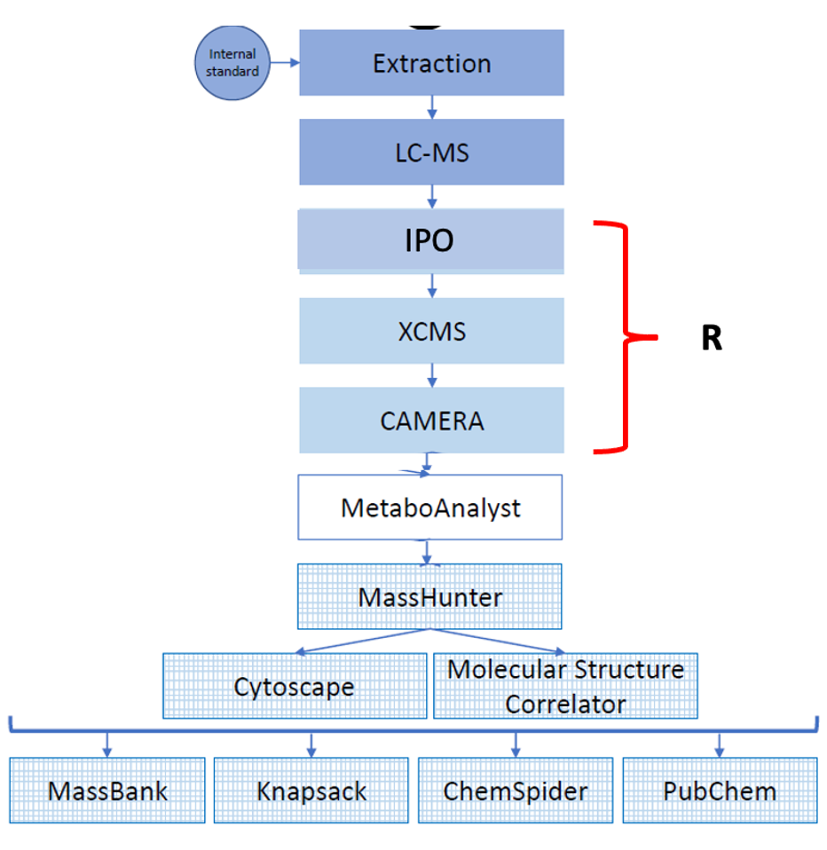
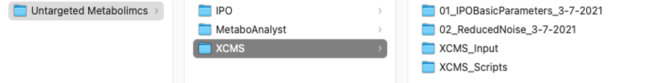
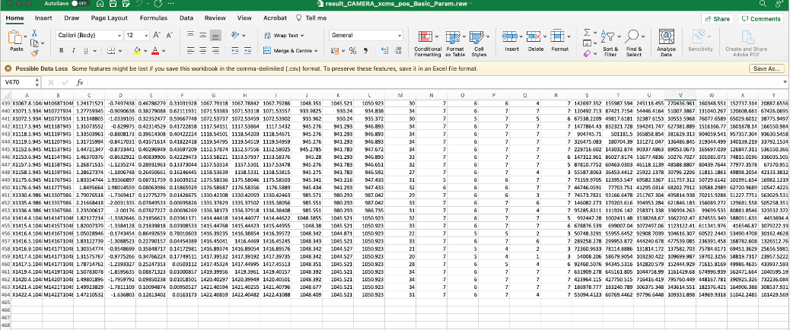
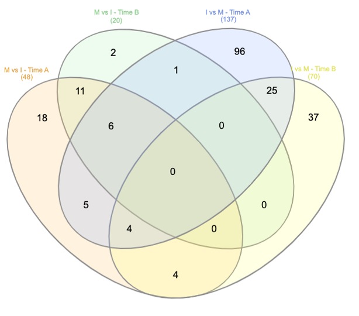

# Processing Metabolomics Data

## **Table of Contents**

1. **[Introduction](#introduction)**
   - _[How to use this document](#how-to-use-this-document)_
   - _[Further reading](#further-reading)_
2. **[Metabolite Extraction Protocol](#metabolite-extraction-protocol)**
   - _[Untargeted protocol](#untargeted-metabolomics-extraction)_
   - _[Hints and Tips](#hints-and-tips)_
3. **[Processing the Raw Data](#processing-the-raw-data)**
   - _[To calibrate and save](#to-calibrate-and-save)_
   - _[Hints and Tips](#hints-and-tips-1)_
4. **[Running IPO](#running-ipo)**
   - _[Determining XCMS parameters with IPO](#determining-xcms-parameters-with-ipo)_
   - _[Hints and Tips](#hints-and-tips-2)_
5. **[Running XCMS and CAMERA](#running-xcms-and-camera)**
   - _[Creating directories](#creating-directories)_
   - _[XCMS parameters](#xcms-parameters)_
   - _[Running your XCMS script](#running-your-xcms-script)_
   - _[Interpreting XCMS results](#interpreting-xcms-results)_
6. **[Preparation and filtering of XCMS and CAMERA output](#preparation-and-filtering-of-xcms-and-camera-output)**
   - _[Preliminary analysis of XCMS results](#preliminary-analysis-of-xcms-results)_
   - _[Npeaks](#npeaks)_
   - _[Number of 0 values](#number-of-0-values)_
   - _[Generating unique identifiers](#generating-unique-identifiers)_
   - _[Removing Adducts and Isotopes](#removing-adducts-and-isotopes)_
   - _[Preparing data for MetaboAnalyst](#preparing-data-for-metaboanalyst)_
   - _[Data Filtering by QCs](#data-filtering-by-qcs)_
   - _[Data Layout](#data-layout)_
   - _[Hits, Tips, and Cheats](#hints-tips-and-cheats)_
   - _[Processing XCMS Output Automatically with R](#processing-xcms-output-automatically-with-r)_
7. **[Statistical Analysis with MetaboAnalyst](#statistical-analysis-with-metaboanalyst)**
   - _[Preliminary analysis](#preliminary-analysis)_
   - _[Following Analyses](#following-analyses)_
   - _[Summary of Statistical Analysis](#summary-of-statistical-analysis)_
   - _[Hints, Tips, and Cheats](#hits-tips-and-cheats-1)_
8. **[Filtering data from MetaboAnalyst](#filtering-data-from-metaboanalyst)**
   - _[Hits, Tips, and Cheats](#hits-tips-and-cheats)_
9. **[Annotating features using the Bruker DataAnalysis Software](#annotating-features-using-the-bruker-dataanalysis-software)**
   - _[To annotate a peak](#to-annotate-a-peak)_
   - _[Points to remember when annotating](#points-to-remember-when-annotating)_
   - _[Common LC-MS adducts](#common-lc-ms-adducts)_
   - _[Common differences observed](#common-differences-observed)_
   - _[Add an Extracted Ion Chromatogram](#add-an-extracted-ion-chromatogram)_
   - _[Hits, Tips, and Cheats](#hits-tips-and-cheats-1)_
10. **[Glossary](#glossary)**

## Introduction

Metabolomics studies are often categorised by the type of analysis, targeted or untargeted. In targeted metabolomics a set of desired compounds are identified. This, typically, is applied when quantitive analysis is required and uses complex extraction protocols. In untargeted metabolomics, an undefined set of features are identified. This allows for novel discoveries in a broad range of compounds, including unknown compounds and metabolites. Untargeted metabolomics uses simple extraction and detection procedures compared to targeted studies but results in highly complex data with increased false discovery burden requiring significantly more effort in data analysis and interpretation. Our lab has developed state-of-the-art untargeted metabolomic profiling methods (figure below) (e.g., methodology from Sambles _et al._, (2017), Sidda _et al._, (2020)) which is laid out here.



## How to use this document

This document is intended to function as guide to the untargeted metabolomics pipeline developed and divided into the following sections:

1. Metabolite Extraction Protocol
2. Processing the Raw Data
3. Running IPO
4. Running XCMS and CAMERA
5. Preparation of XCMS and CAMERA output
6. Statistical Analysis with MetaboAnalyst
7. Filtering data from MetaboAnalyst
8. Annotating features using the Bruker DataAnalysis Software
9. Glossary

Each section provides a brief overview and explanation for the process, step-by-step guide to the task, as well as a Hints and Tips section.

It is in the hints and tips sections I have explained the bugs, challenges, and things to bear in mind throughout each step. It is worthwhile reading this section before you start each process.

Code in the text is provided in this format.

Large blocks of code can be found in code blocks like this.

## Further reading

Sambles, C.M., Salmon, D.L., Florance, H., Howard, T.P., Smirnoff, N., Nielsen, L.R., McKinney, L.V., Kjær, E.D., Buggs, R.J., Studholme, D.J. and Grant, M., 2017. [Ash leaf metabolomes reveal differences between trees tolerant and susceptible to ash dieback disease](https://www.nature.com/articles/sdata2017190). _Scientific data_, _4_(1), pp.1-13.

Sidda, J.D., Song, L., Parker, J.L., Studholme, D.J., Sambles, C. and Grant, M., 2020[. Diversity of secoiridoid glycosides in leaves of UK and Danish ash provide new insight for ash dieback management](https://www.nature.com/articles/s41598-020-76140-z). _Scientific reports_, _10_(1), pp.1-12.

## Metabolite Extraction Protocol

Depending on the sample volume, this whole procedure may have to be done in fume hood (until centrifugation step). Work out how much total solvent you will need and carefully decant from the large 2.5 L bottles into a smaller (e.g., glass 20 mL sample vial or 100 mL **clean** Duran bottle). Do not pipette directly out of the solvent bottles to avoid contaminating the rest of solvent bottle. The only exception to this is acids, where it may be safer to pipette directly out of the bottle but if so check what kind of pipette to use e.g., glass.

If sample volumes are ≤1 mL (as they will be in the majority of cases), once solvent has been added to each tube then the samples can be removed from fume hood.

Solvents MUST be **HPLC grade** (for acids analytical reagent grade will do) please check we have them in the lab before starting for experiment. If not, you will have to order them from Stores 24 h before you need them or other from OPeRA.

_For procedures where extractions are performed on ice_, pre-cool solvents on ice for ~30 min before starting

1 L / 2.5 L bottes of solvent MUST be handled in fume hood with the sash down and concentrated acids (acetic acid, formic acid) MUST be handled in fume hood at all times.

**Waste streams:**

- **Please read** [**SOP_SLSWMS 007 Waste Chemical Disposal.**](https://warwick.ac.uk/fac/sci/lifesci/intranet/staffpg/support/safety/sops/generalsops/)
- **Solid waste** contaminated with chemical traces (e.g., tubes once the solvents have been pipetted out) are to be disposed of in solid waste containers (round plastic bottles with yellow lids)
- **Solvent waste** bottles are to be stored in the yellow solvent cabinet. Please check if there is a bottle currently in use before starting a new one. Labels for these can be found on top of the yellow waste solvent cabinet.
- GLP chemicals need to be put down the sink with plenty of water and the container rinsed out with water.
- Any chemical with a hazard **MUST** be disposed of via chemical waste route.
- Do **NOT** put in autoclave tins at any concentration.

### Untargeted metabolomics extraction

_Bananas - Add 400 µL solvent to 10 mg sample._

_solvent A **usually** 80% methanol plus internal standard._

_solvent B **usually** 80% methanol._

1. Add solvent A to sample and incubate on ice, ensuring sample is resuspended. Then vortex for 30 seconds every 10 min for 30 minutes, returning to ice in between.
2. Sonicate for 15 minutes in ice-cold sonicator.
3. Centrifuge at 13000 rpm speed for 10 minutes at 4oC.
4. Carefully remove supernatant with pipette and transfer to a clean Eppendorf.
5. Repeat step 1 with solvent B, but only 20 min extraction this time.
6. Sonicate for 15 minutes in ice-cold sonicator.
7. Centrifuge at 13000 rpm speed for 10 minutes at 4oC. Carefully combine supernatant with that from step 4.
   - _If your sample won`t be run right away, store the combined supernatants in the dark at 4°C._
8. Carefully filter each sample through a PVDF syringe filter (max 600 µL volume at a time) and transfer the filtrate into a glass LC-MS vial.
9. Create Quality control samples which are interspersed evenly through the run by aliquoting **a few μL** (this will depend on the total number of samples you have) from each sample into an empty LC-MS vial.

### Hints and Tips

- We have experienced salt build up around the source of the instrument. To limit this, please consider the following:

1. _Centrifuge filters at \<2000 g._
2. _Don`t cool samples after filtering to stop anything precipitating out._
3. _You may wish to add additional centrifugation step before filtering of samples if they have sat in fridge overnight._

\*We have not been using an internal standard for Banana Metabolomics.

## Processing the Raw Data

Once the raw data has been supplied, ensure that it is saved on the high-capacity shared server, HCSS3 in Shared258. You may wish to have a compressed version saved on here to maintain space. A further copy should be saved on your machine or the workstation in B1.34. It is worthwhile duplicating and compressing the data again on this machine, providing an additional back-up of the original data.

Data should then be loaded into the DataAnalysis software (available on the workstation in B1.34), calibrated to the sodium formate peak, and saved as MzXML files for XCMS. Rename the MzXML file after its order in the run and the sample name. Save the MzXML file in another directory. Again, once you have calibrated, saved, and renamed all the samples, consider duplicating and compressing the MzXML directory.

### To calibrate and save

1. Open the files in the Bruker DataAnalysis software by dragging and dropping.
2. Ensure that you are viewing the chromatograms in analysis view.
3. Double click on a sample and open chromatogram. Select the sodium formate by right clicking and dragging over the peak. This will have eluted between 0 and 1 minute and is typically between the dashed blue lines.
   1. _Note the sodium formate peak m/z and retention time in your lab book._
4. Select the `spectrum view` pane and right click, copy to compound spectra.
5. Select Calibrate, then Internal.
   1. You will need to select the `Na Formate (neg)` in the calibration dropdown list for negative mode data.
6. Remove samples with PPM >0.1
7. Once all samples with PPM >0.1 have been removed, recalibrate.
8. Then  Save and export: `Export-> Chromatogram Analysis-> MzXML`. Rename the MzXML file including its position in the run, mode (+ve or -ve) and the sample name.
9. Ensure you save positive and negative data sets in different sub folders.
   1. _You may also want to rename all the raw files in this directory, following the same formula used for the MzXML files._
10. Repeat for each sample.

### Hints and Tips

Now is a good opportunity to look at the entire chromatograms and consider how messy they are. Does there seem to be a high amount of noise? Are there any samples you may wish to exclude?

## Running IPO

Before identifying features, we must first determine parameters for XCMS. To do this we use IPO. IPO, or Isotopologue Parameter Optimization, is a tool developed by [Libiseller, G _et al.,_ (2015)](https://bmcbioinformatics.biomedcentral.com/articles/10.1186/s12859-015-0562-8) which optimises the peak picking parameters by using natural, stable 13C isotopic peaks. Retention time correction is optimized by minimizing relative retention time differences within peak groups. Grouping parameters are optimized by maximizing the number of peak groups that show one peak from each injection of a pooled sample.

An IPO script for both windows and Mac OS is available in the directory with which this document was shared.

### Determining XCMS parameters with IPO

1. Create a directory in which you can run IPO. I like to create three subdirectories, one for scripts, one for input, and one for output.
2. Copy your calibrated MzXML files and the example script into the appropriate directories (e.g., `IPO_Input`).
3. The IPO script will need amending to suit the new directories you have created. For `setwd()`enter the path the to the master IPO directory. Under `datafile <- list.filesenter` the path to the input MzXML files saved for IPO. You can do this using the full path, or by using the `./[Input_Directory_Name]`.
   1. _Check that IPO has been installed. If it needs to be installed, run the section of code at the top of the script titled: Install IPO. This will have been commented out. To run it you will need to remove the #. Replace the hashtags once IPO has been successfully installed._
4. You will need to adjust the `time.xcmsSet, optimizeXcmsSet filesparameter` to the total number of MzXML files you have `[1:X]`. This is line 42 in the example script, and in this instance there are 32 input files.
5. Save your adapted script with a new name in the scripts folder.
6. Run each line, checking that the working directory has been set and the entry for `datafiles` is correct.
7. Once IPO has finished, an R script will be produced as output. Save this output in a text file.

### Hints and Tips

- Ensure that file paths are in quotation marks `("/Path/to/File")`. These appear in green text in R.
- IPO can take several days, especially when there are large numbers of files. If it is taking a long time, consider removing the blanks from the analysis. You can also use the following commands to see how long each section of IPO was running (the time is given in seconds):

`> time.xcmsSet`

`> time.RetGroup`

## Running XCMS and CAMERA

XCMS is a bioinformatics software designed for statistical analysis of mass spectrometry data. Both an online cloud version and R package are available. We primarily use the R version as it allows for greater modification of parameters. XCMS uses the parameters you enter (informed by the results from IPO) to identify features within your data. For more information on XCMS, see the chapter [Metabolomics Data Processing Using XCMS](https://pubmed.ncbi.nlm.nih.gov/31953810/) by Xavier Domingo-Almenara and Gary Siuzdak (2020).

### Creating directories

Directories are important for XCMS, and you`re going to end up with **A LOT** so keeping an organized system it essential. This is how I do it and I recommend doing something similar.

First, I create a new directory for all the XCMS analysis. Within this directory, I create two sub directories. One for XCMS scripts and one for the MzXML inputs, like that which was created for IPO.

>_Note: XCMS uses the directories to define sample groups. If you wish to combine the treatment groups differently, you will have to create another input directory and rearrange your samples to suit. It is worthwhile removing your blanks at this point. You can also encounter some difficulties with QCs. If you have the same number of QCs as samples in each group, then you can create a separate directory for the QCs. If, however, you have fewer QCs than samples in each group, you should ensure that there is one QC sample in each treatment group directory (you may need to duplicate QCs for this)._

I copy the example XCMS script and paste it in the `XCMS_Scripts` directory. I then copy all the original MzXML files into the `XCMS_Input` directory. Once the input files have been copied, I create a directory for each treatment group within the `XCMS_Input` directory, e.g., `Mock_TimePoint_A`, `Mock_TimePoint_B`, `Inoculated_TimePoint_A`, `Inoculated_TimePoint_B`, and I then move the MzXML files into the appropriate directories.

You will run XCMS multiple times while you determine the ideal parameters for your dataset. It is therefore best to create a new directory for each run. I try to maintain a directory naming system for this whereby each directory is given a number, the parameters tested, and a date e.g., `01_IPOBasicParameters_3-7-2021`. This will make finding the directories and remembering what you have done easier later.

Here is an example directory layout:


Additionally, I create an excel spreadsheet. In it I note the name of the new XCMS directory, the input files, the parameters I am using – highlighting the parameters each time I change them, and the name of the new XCMS script.

Your input files must be in your working directory, I therefore copy the `XCMS_Input` files into the directory for each iteration of XCMS (e.g., `XCMS_Input` is copied to `01_IPOBasicParameters_3-7-2021`).

## XCMS parameters

The following are parameters which are included in the R script provided. For more information on parameter selection in XCMS, see [Optimization of XCMS parameters for LC–MS metabolomics: an assessment of automated versus manual tuning and its effect on the final results](https://link.springer.com/article/10.1007/s11306-020-1636-9) by Albóniga _et al.,_ (2020).

| **Function**  | **Parameter**  | **Description**  |
|:---: |:---: |:---: |
| xcmsSet  | method  | “centWave”   |
|   | peakwidth  | The expected approximate peak width in chromatographic space. Given as a range (min, max) in seconds.  |
|   | ppm  | Defines the maximal tolerated m/z deviation in consecutive scans in parts per million (ppm) for the initial ROI definition.  |
|   | noise  | Set a minimum intensity required for centroids to be considered in the first analysis step (centroids with intensity < noise are omitted from ROI detection).  |
|   | snthresh  | The signal to noise ratio cut-off.  |
|   | mzdiff  | The minimum difference in m/z dimension required for peaks with overlapping retention times; can be negative to allow overlap. During peak post-processing, peaks defined to be overlapping are reduced to the one peak with the largest signal.  |
|   | prefilter  | Specifying the prefilter step for the first analysis step (ROI detection). Mass traces are only retained if they contain at least k peaks with intensity >= I.  |
|   | mzCenterFun  | Name of the function to calculate the m/z center of the chromatographic peak. Allowed are: "wMean": intensity weighted mean of the peak`s m/z values, "mean": mean of the peak`s m/z values, "apex": use the m/z value at the peak apex, "wMeanApex3": intensity weighted mean of the m/z value at the peak apex and the m/z values left and right of it and "meanApex3": mean of the m/z value of the peak apex and the m/z values left and right of it.  |
|   | intergrate  | Integration method. For integrate = 1 peak limits are found through descent on the Mexican hat filtered data, for integrate = 2 the descent is done on the real data. The latter method is more accurate but prone to noise, while the former is more robust, but less exact.  |
|   | fitgauss  | Determines whether or not a Gaussian should be fitted to each peak. This affects mostly the retention time position of the peak.  |
|   | verbose.coloumns  | Whether additional peak meta data columns should be returned.  |
| retcor  | method  | “obiwarp”  |
|   | plottype  | Plot retention time deviation.  |
|   | distFunc  | DistFunc function: cor (Pearson`s R) or cor_opt (default, calculate only 10% diagonal band of distance matrix, better runtime), cov (covariance), prd (product), euc (Euclidean distance).  |
|   | profStep  | Step size (in m/z) to use for profile generation from the raw data files.  |
|   | center  | The index of the sample all others will be aligned to. If center==NULL, the sample with the most peaks is chosen as default.  |
|   | response  | Responsiveness of warping. 0 will give a linear warp based on start and end points. 100 will use all bijective anchors.   |
|   | gapInit  | Penalty for gap opening.  |
|   | gapExtend  | Penalty for gap enlargement.   |
|   | factorDiag  | Local weighting applied to diagonal moves in alignment.  |
|   | factorGap  | Local weighting applied to gap moves in alignment.  |
|   | localAlignment  | Local rather than global alignment.  |
| Group  | method  | “density”  |
|   | bw  | Bandwidth (standard deviation or half width at half maximum) of gaussian smoothing kernel to apply to the peak density chromatogram.  |
|   | mzwid  | Width of overlapping m/z slices to use for creating peak density chromatograms and grouping peaks across samples.   |
|   | minfrac  | Minimum fraction of samples necessary in at least one of the sample groups for it to be a valid group.   |
|   | minsamp  | Minimum number of samples necessary in at least one of the sample groups for it to be a valid group.  |
|   | max  | Maximum number of groups to identify in a single m/z slice.  |

## Running your XCMS script

1. Open the Example XCMS script and save it with a new name, preferably in the new directory you have generated for XCMS scripts (remember to do this each time you adjust a parameter).
2. The output from IPO can be used as parameters for your starting XCMS code. It is best to adapt the example XCMS script already prepared and supplied with this document. Once you have opened the example XCMS script, either copy and paste the IPO output into the "settings" section of the example XCMS script, or manually change each parameter.
   - _Check that XCMS and CAMERA are installed. If it needs to be installed, run the section of code at the top of the script titled: Install XCMS and CAMERA. This will have been commented out. To run it you will need to remove the `#`. Replace the hashtags once the packages have been successfully installed._
   - _Consider the MinFrac value at this point. IPO often sets it to 1, meaning the feature will have to appear in all your samples._
3. Now adjust the working directory within the XCMS script. This should be set to the current iteration of XCMS, e.g., `01_IPOBasicParameters_3-7-2021`. Remember to adjust this each time you run XCMS! E.g.:

```bash
setwd("~Untargeted Metabolomics/XCMS/01_IPOBasicParameters_3-7-2021")
```

4. Your input files must be in your working directory, I therefore copy the `XCMS_Input` directory into the current directory in which XCMS will be run (e.g., `01_IPOBasicParameters_3-7-2021`) and then set the `datafiles` path to this directory.
   
```bash
datafiles <- list.files("`~Untargeted Metabolomics/XCMS/01_IPOBasicParameters_3-7-2021``/XCMS\_Input", recursive = TRUE, full.names = TRUE)
```

5. Lines 71 and 76 have a `write.csvcommand`. These lines create two excel files will be produced as output from this script and direct the outputs to the current working directory. Now is your opportunity to name the output files following on from `file=` in the command. Ensure the new name is in quotation marks, e.g., `file="NEW_NAME.csv"`.
6. Once you have adjusted the parameters, changed the paths, and renamed the output files, run the `setwd()` and `datafileslines`, ensuring the correct directories have been set and the correct sample files chosen.
7. You can now run the entire script; this may take some time depending on the number of samples you have.

## Interpreting XCMS results

XCMS will generate several graphs showing retention time and m/z deviation in samples in the plot window of R studio. You should look through these graphs checking data are normal distributed. Look for any samples which deviate significantly and consider whether these samples should be removed from the analysis.

You will be presented with two excel spreadsheets you named in step 5 of [Running your XCMS script](#running-your-xcms-script). The one in which most of the work is done the CAMERA and XCMS combined file, the spreadsheet written at line 76 in the example code. Open the combined csv and scroll to the bottom. Look at the number of rows you have. This will tell you the number of features you have identified plus one (as the first row is column headers). Record the number of features for this iteration of XCMS in your master Excel spreadsheet (the one documenting directory names and parameters).

Consider the number of features you have identified. Is this an appropriate amount? This is a challenging question to answer because, unless you already have a rough idea of the number of features you might expect based on previous research, it really is hard to determine what number is acceptable and consequently how much you should tweak you XCMS parameters. Ideally you want less than 5000 (For MetaboAnalyst), while still maximizing the number of true features.

How does changing parameters affect the number of features and will it get you nearer to a desired or more reasonable amount? To answer this, you must run XCMS multiple times tweaking a parameter each time. The parameters I suggest you start with are:

- Peakwidth
- Noise – this can be informed by your raw data.
- Center – Consider which sample would be good to align all other too.
- Minfrac

Your samples will also affect the number of features you identify, it is therefore beneficial to conduct some preliminary analysis of the XCMS results before you repeat the XCMS analysis with a parameter adjusted. See the [_Preliminary analysis of XCMS_](#preliminary-analysis-of-xcms-results) section of this document for an explanation of the types of analysis you can do to determine whether any contaminated samples are significantly affecting your XCMS output.

Once the primary analysis has been completed in Excel and you are happy with your samples, repeat the steps outlined in [Running your XCMS script](#running-your-xcms-script) adjusting the XCMS parameters with each run to determine the final set of parameters you will use.

>
In the example shown here, we have a total of 463 features. This is small considering we can submit 5000 features to MetaboAnalyst. We therefore decided to continue tweaking the XCMS parameters using what we know about each parameter and recording the increase/decrease in the number of features. The final set of XCMS parameters included a decreased noise threshold, lower Minfrac value and an increased peak width compared to the suggested parameters generated by IPO for this dataset.

## Preparation and filtering of XCMS and CAMERA output

We can use the Excel sheet produced by XCMS and CAMERA to assess the efficacy of our XCMS parameters and to infer the quality of our samples. The first column of the excel document is the name that XCMS has allocated to the feature it has identified where "M" is the m/z and "T" is the retention time. The following 11 columns are the outputs for basic statistical analysis which XCMS performs. The following columns will be labeled with the sample groups you have created, with each row indicating the number of samples which contain peaks for that feature XCMS has identified. Then, following columns will provide the peak area for a given feature in each sample.

### Preliminary analysis of XCMS results

You can follow the steps outlined below if you would like to perform this step manually, further, you can read the steps below to gain a greater understanding of the post-processing of the XCMS result. However, there is an R script available, [`ProcessingXCMSOutput-Automated.R`](#processing-xcms-output-automatically-with-r) which will do all of the post-processing for you, speeding up this process. It is best to have read this section to be able to interpret the outputs, however.

#### Npeaks

In theory, the total number of peaks identified for each feature should be roughly equal to or less than the total number of samples. If the number of peaks for a given feature is significantly greater than the number of samples, it **_may_** suggest that the feature is not real or a contaminant. We therefore check to see for how many features the number of peaks is greater than the number of samples, and for any features which have more peaks than the number of samples, how much higher this value is than the number of samples. This can be done by following the steps below in your XCMS and CAMERA Excel output:

1. Locate the npeaks column and scroll to the bottom, empty cell.
2. Input the following formula, adapting the text in square brackets to suit the values you have:

```excel
=countif(M2:[End of Features Cell], "\>[NumberOfSamples]")
```

3. If the value is higher than 0, locate the features which are greater than the number of samples (you may wish to use the highlight cell rules feature in Excel). Is the value much greater than the number of samples, could this feature be a contaminant or is something else going on? Are your XCMS parameters too lenient?

#### Number of 0 values

Similarly, we want to calculate the number of features that are not identified within each sample. If this is significantly high (\> ~10%) for only a few samples, then look at the raw data for that sample and check to see if there are any anomalies in the run. Additionally, we can consider removing the sample.

To calculate the number of 0 values for each sample, enter the following code at the bottom of each sample peak area column:

```excel
=countif([sample column]2:[bottom of sample column], "=0")
```

To express this as a percentage in the cell below:

```excel
=sum([number of 0 values]/[Number of samples]\*100)
```

#### Identification of Outliers (University of Birmingham Approach)

We want to identify potential outliers in our data for various reasons, including ensuring sample integrity. Here`s how you can do it in Excel:

1. Group your data by separating it into two categories: biological samples on the left and QC samples on the right of the worksheet.
2. Count the number of peaks in each biological sample using Excel`s `COUNT` function. For the first sample in the left-hand column

```excel
=count([sample column]2:[bottom of sample column])
```

1. Total the peaks in each biological sample by using the `SUM` function in the same left-hand column

```excel
=sum([sample column]2:[bottom of sample column])
```

3. Apply these formulas to all samples by dragging and highlighting the cells. This will calculate `COUNT` and `SUM` for all samples. Optionally, calculate the mean or median peak area to account for extreme values.
4. Visualise the data with a scatter plot. Highlight the row with the count of peaks in each sample and create a scatter plot using Excel`s `Insert` and `X Y (Scatter)` option. Use the scatter plot to identify potential outliers in your data.
5. Repeat this for the sum of peaks. Are there any outliers in the data?
6. You can also do this for individual features. If you have added any internal standards, you can repeat the previous steps for them, selecting the rows which correspond and identifying any outliers in your samples.

#### Generating unique identifiers

For downstream analysis, it is beneficial if each feature has a unique identifier. If features share a m/z and retention time, XCMS will simply append "_1" to the feature name. This makes it difficult to identify which features are significant in the raw data once the statistical analysis has been done. We therefore generate unique identifiers for each feature. This can be done following the steps below:

1. Create a new column in column A called Round MZ. In the top cell enter `=round([mzmed Cell], 1)`. Then drag the formula down so that the formula is applied to all features.
2. Create a new column in column B called Round RT. In the top cell enter `=round([rtmed Cell], 1)`. Then drag the formula down so that the formula is applied to all features.
3. Then create an additional column in row A and title it `Unique Identifiers`. Using the output in the two new rounded cells (Round MZ, Round RT) concatenate the values into the `Unique Identifiers` column using the following command `=concat("M",[Round MZ],"T",[Round RT])`. Then drag the formula down so that the formula is applied to all features.
4. The data in these cells is currently the output of a formula. To complete the next steps, Excel needs to recognize the data as "values". To do this, create a further column in column A. Copy the concatenated results as well as the column name, `Unique Identifiers` and paste them as values using the "paste special" option.
5. You can now use conditional formatting to highlight duplicates. On Mac, select the `conditional formatting` -> `highlight cell rules` -> `duplicate values`.
6. Now sort the column by selecting the `Sort & Filter` tab, then `custom sort`. If the sort warning appears, select `expand current selection`. Now select the appropriate drop downs so that the column of unique identifiers is organized by colour, with coloured cells appearing at the top.
7. Delete the two new columns created for rounding (Round MZ, Round RT). Rename any duplicates adding more decimal places to the m/z or retention time for that feature so it can be easily identified later. Save the file with a new name using Save As.

#### Removing Adducts and Isotopes

Isotopic peaks and adducts, although useful for annotating features later, will increase your data unnecessarily, they can therefore be removed.

1. To prevent the loss of any data and keep a record of the initial output form XCMS and CAMERA, copy and paste the data in the .csv you generated to a new sheet called `Isotopes removed` (you may have to save the file as an .xls file to do this).
2. Locate the isotopes column in your copied spreadsheet and apply a filter.
3. Enter `M+1` in the filter search bar and apply the filter.
4. Highlight all the rows which have been identified by the filter and delete the cells.
5. Continue to work through the M+ data: M+2, M+3, M+4 …

### Preparing data for MetaboAnalyst

Now that the features have been given unique identifiers and isotopes have been removed, the data must be filtered for MetaboAnalyst.

#### Data Filtering by QCs

1. Copy the data from the previous step to a new sheet called `Filtered`.
2. Cut the QC columns from the sheet and paste them in new columns at the end of the sheet.
3. Calculate the average the peak area values in the QC columns for each feature using `=AVERAGE([QC Cells for Feature]`. Then generate the standard deviation for the QCs using `=STDEV([QC Cells for Feature]`.
4. Drag the formula down so that the formula is applied to all features for the QC samples.
5. Using the average and standard deviation of peak area for each feature in the QC samples, calculate the relative standard deviation for each feature identified in the QC samples. The following formula can be used `=sum([STDEV]/[AVERAGE])*100`.
6. Apply conditional formatting as we did for the generating the Unique Identifiers, this time select `Condition Formatting`, `Greater Than` and enter 30. This will highlight all cells >30% relative standard deviation. Remove these rows from the dataset.

MetaboAnalyst requires less 5000 features, we will therefore need to reduce the number of features we have identified if it is greater than 5000. If you have < 5000 features continue to the next step (data layout). If you have >5000 features, try a more stringent relative standard deviation threshold, such as 20%.

#### Data Layout

The data must be laid out in a different format from the one which we have been using. The .xls file produced in the previous steps [Generating Unique Identifiers](#generating-unique-identifiers) and [Preparing data for MetaboAnalyst](#preparing-data-for-metaboanalyst) can be adapted for MetaboAnalyst by following the steps below:

1. Copy the data from the `Filtered` sheet generated in the [Preparing data for MetaboAnalyst](#preparing-data-for-metaboanalyst) step and paste the data into a new sheet called `MetaboAnalyst Input` using copy, paste special, **transpose**.
2. Remove all rows **apart from** the unique identifiers and the peak areas for the individual samples. Rename the unique identifier column to `sample`.
3. Remove rows such as: name, fold, tstat, pvalue, anova, mzmed, mzmin, mzmax, rtmed, rtmin, rtmax, npeaks, and your sample groups.
4. Insert a new column between column A and B called `condition`. In this column enter the treatment group that the sample listed in column A belongs.
   - _Ensure that you are consistent with naming here. Differences in capitalisation and spelling will result in different groupings in MetaboAnalyst._
5. Ensure that the QC samples are removed.
6. Identify the sodium formate peak using the m/z and retention time you noted down when preparing your raw data in [Processing the raw data](#processing-the-raw-data) section of this document. You may wish to rename the column to `sodium_formate`, but you should at least note the Unique Identifier. It will likely be a feature with a mass of around 227 and a retention time between T = 1 and 18.
7. Save this sheet as a `.cvs` file. Ensure that you use `Save As` and rename the document so as not to save over the original outputs.

### Hits, Tips, and Cheats

- Retention time is given in seconds.
- Any features identified before 60 seconds are unlikely to be real.
- You can quickly navigate around an Excel spreadsheet by pressing CMD, and then the arrow key pointing in the direction you wish to go.
- Filter by QC if you have more than 2 QCs.
- The number of rows -1 will give you your total number of features.
- To avoid typing the code for each sample, enter the code for in one cell then drag the formula across all the columns or rows.

---

### Processing XCMS Output Automatically with R

You will need to edit some of the parameters at the top of the document, which are clearly marked in the R script and explained below.

This script will take the XCMS and CAMERA output csv file and process it for MetaboAnalyst, following steps normally performed manually in Excel and uses as part of the University of Warwick and University of Birmingham data processing steps.

**Processing includes:**

- count number of features & number of features when no peaks identified in blank group [University of Warwick].
- count n peaks > n samples and n peaks > double n samples  [University of Warwick]
- count number of 0 values for each feature per sample, and express as a percentage. [University of Warwick]
- count the number of peaks per sample and produce scatter plot [University of Birmingham]
- sum the area of all peaks per sample  and produce scatter plot [University of Birmingham]
- calculate the mean, stdev, relative standard deviation (RSD) and count of given set of QC samples (PrecisionQCs) to calculate precision. [University of Birmingham]
- calculate the blank mean and percentage contribution of given set of blank samples (Blank_samples) to calculate blank contribution. [University of Birmingham]
- filter based on the RSD of QCs and % blank contribution: thresholds can be changed below.
- filter out isotopes detected by CAMERA.
- add unique identifiers to each feature.
- convert the table to csv for MetaboAnalyst, inputting unique IDs and sample peaks, as well as creating an empty column for condition.

At the top of the script, there are some variables which will need to be changed to suit. You will need to input your file path, sample list (including blanks and QCs), a separate QC list, a separate Blanks list, as well as the RSD filter and Blank contribution filter. I have provided an example set up below.

```R
# Define the input file path and sample lists. 

# Set your working directory. 
setwd("/Volumes/Jamie_EXT/Research/Metabolomics/NovDec22/XCMS/05_EarlySamplesRemoved_121023/")
# Replace with your data file. 
data_file <- "./result_CAMERA_xcms_pos_Basic_Param.raw.csv"

# Replace with your sample list
sample_list  <- c("C9-1","C9-2","C9-3","C9-4","D9-1","D9-2","D9-3","D9-4","F9-1","F9-2","F9-3","F9-4","X9-1","X9-2","X9-3","X9-4","C12-1","C12-3","C12-4","D12-1","D12-2","D12-3","D12-4","F12-1","F12-2","F12-3","F12-4","X12-1","X12-2","X12-3","C15-1","C15-2","C15-3","C15-4","D15-1","D15-2","D15-3","D15-4","F15-1","F15-2","F15-3","F15-4","X15-1","X15-2","X15-3","X15-4","BLANK_2","QC-1_Dup","QC-1","QC-2","QC-3")  

###################################
#Filtering
###################################

#Filtering Samples:
#Please list the QC samples you wish to pool to calculate precision.
PrecisionQCs <-  c("QC-1","QC-2","QC-3")
#Please list the Blank samples you wish to pool to calculate the blank contribution. 
Blank_samples <-  c("BLANK_2") 

#Filtering parameters:
RSD_Filter <- 29.99 #The University of Birmingham filter their data based on the relative standard deviation of their QC samples. They use a threshold of 30%, which is set here as default. You can change if you would like. Set too 100 if you do not want to use the RSD_Filter.  
Blank_contribution_filter <- 100 #The University of Birmingham filter there data based on the percentage blank contribution. They use a threshold of 5%, which is set here as default. You can change if you would like. Set too 100 if you do not want to use the Blank_contribution_Filter  

```

You will need to modify the MetaboAnalyst csv, ensuring that you fill in the empty column (`column B`) with the treatment group corresponding to the sample in `column A`.

This script also sometimes filters out the sodium formate peak, and you may need to add it back in if you wish to normalise to it.

## Statistical Analysis with MetaboAnalyst

All statistical analysis is performed using the publicly available tool, [MetaboAnalyst](https://www.metaboanalyst.ca/). Although an R package is available, we will focus on the web tools as it has a user interface. For more information about MetaboAnalyst please see [this list of publications](https://www.metaboanalyst.ca/MetaboAnalyst/docs/Publications.xhtml).

### Data upload

To perform the analysis, we must first [open the platform](https://www.metaboanalyst.ca/MetaboAnalyst/ModuleView.xhtml) and select `Statistical Analysis [one factor]`.

Once selected, you will be presented with the data upload page. In the `A plain text file (.tsv or .csv)` box, select `Peak intensities`, ensure that the format is `samples in rows (unpaired)`, and upload your data file generated in the previous step ([Preparing data for MetaboAnalyst: Data Layout](#data-layout) or the output from [the r processing script](#processing-xcms-output-automatically-with-r)) and click submit.

You will then be presented with a `Data processing information:` box. Check the number of features matches the number you have produced following the [Preparation and filtering of XCMS and CAMERA output](#preparation-and-filtering-of-xcms-and-camera-output) section of this document. Click proceed if it matches.

### Data filtering

The ‘Data Filtering’ page: This is used to identify and remove variables that hinder
the identification of biologically important signals. For example:

1. Very small values (close to baseline or detection limit).
2. Variables that are constant across conditions
3. Variables that show low repeatability using %RSD for example.
4. The dataset is reduced is size for ease of processing and analysis.

Next, we must tell MetaboAnalyst how to filter our data. We typically filter using one of two options, either `none` or using the default `Interquartile Range`.

You will note that we have already done most of the data filtering, and so, in this instance the, `None (less than 5000 features)` option can be selected and we can proceed.

### Data normalisation

Again, we use one of two methods for normailsation. Either we `normalise by reference feature` or by `sum` (as well as selecting; `log transformation` for data transformation and `Pareto scaling` under Data scaling)

Normalise by reference feature if you want to compare to an internal standard. If you do not have an internal standard, you can normalise using the the sodium formate peak, which elutes at the start of the run. You should have noted this down or renamed the column as instructed in the [Preparing data for MetaboAnalyst: Data Layout](#data-layout) section of this document. Select the `Normalization by reference feature` option and then click specify. Enter the unique identifier for the sodium formate. Then select `Normalize` and `View Result`. This will generate a graph which is saved at the end of the analysis. Once complete, select `Proceed`.

If you do not wish to normalise to a reference feature, select `normalise by sum` and select `log transformation` for data transformation and `Pareto scaling` under Data scaling.

>_Remember to view the result of your normalisation and check that you data follow a normal distribution. Further, you can use (non‐hierarchically clustered) heat maps (found in the statistical analysis section) to assess the effect of different data‐driven normalisation approaches. This is usually a good practice as it gives you a visual overview of the entire dataset and allows you to inspect and verify the effect of the data processing parameters (e.g. compare their
effects)._

### Preliminary analysis

Depending on your sample groupings, you will either need to perform an ANOVA or t-test. Select the appropriate test and then wait for the results. You may wish to alter the FDR adjusted P values. This can be done using the FDR adjusted P Value boxes.

Click the small table symbol () each time you adjust the P value and save the output. MetaboAnalyst will only save the last table generated for each statistical test. So, if you try multiple FDR adjusted P Values you will lose the earlier cut-offs.

You may also just want to use just the P value rather than the FDR adjusted P value. To do this, set the FDR adjusted P value to a higher value (e.g., 1) and view the table. Using the P value column, find the P value you wish to use, then look at the value in the FDR adjusted P value column. Copy this value and enter it in the FDR adjusted P value box once the table has been closed.

Also select the `Principal Component Analysis` and `Heatmap` options - listed on the left-hand side - to see how samples cluster. For data with only two groups (t-test), you should also select the volcano fold change plots, changing P values as necessary.

Once complete, select the `Download` tab then `Generate Report` and `Download.zip`. This will download a summary of the statistical tests performed as well as the plots and tables generated. This data can be saved for later analysis.

### Following Analyses

Once the preliminary analysis has been performed and you have your set of significant features, you can remove any features that are not significant from the MetaboAnalyst input `.csv`. Ensure that the sodium formate peak is not removed and that you `Save As` with a new file name.

You can now generate PCAs and Heatmaps with only the significant features and consider group clustering. You may also wish to complete pairwise comparisons using only two groups. This too can be done by copying significant features and specific groups from the original MetaboAnalyst input `.csv` and inputting that data into a new `.csv` to upload to MetaboAnalyst.

Fold-change data is very useful for identifying whether features which have a similar m/z and retention time are likely to be from the same compound. If the fold change is in opposite directions, they are likely to be from different compounds. If it is in the same direction and a similar amount, the features are likely to be from the same compound. I therefore encourage you to perform Fold-change analysis of significant features with each of your groupings in MetaboAnalyst and save the outputs.

## Summary of Statistical Analysis

1. Preliminary ANOVA
2. Load data in MetaboAnalyst
3. Select normalisation and filtering parameters
4. Perform ANOVA and generate heatmap
5. This reduces number of features to manageable size
6. Pairwise Comparisons
7. Select the features which are significant from XCMS output and order them into all the possible pairwise comparisons you would like to do.
    1. e.g., mock vs inoculated at time point A; mock vs inoculated at time point B.
8. Submit data to MetaboAnalyst again performing t-test, fold change analysis, and generate a heatmap.
9. Sort fold change analysis by retention time.
10. Now use significant features (from t-test output), sort the fold change analysis data with sig. features at top (highlighted) and rest of features below.
11. Now we can begin to work out the number of molecules we have by filtering the MetaboAnalyst data.

## Hints, Tips, and Cheats

- Ensure your key is correctly labelled and well coloured now to save you having to generate these figures again later.
- Save the images as the highest res pdf, so that they can be edited and adapted later without having to reload your data.
- MetaboAnalyst saves the last csv it generates for each stat by default, so you should save each one individually if you change the P values.

# Filtering data from MetaboAnalyst

Once you have identified your significant features in MetaboAnalyst, you should filter the data and establish a sensible number of features to annotate. There are number of ways we can reduce the number of features, the first being interactions.

Using the fold change excel file you have generated in MetaboAnalyst, identify the significant features for each pairwise comparison and enter them into [InteractiVenn](http://www.interactivenn.net/) (See example figure). You can now choose to focus on features which interact, or do not interact, depending on what you are looking for.

Say you are looking for a feature which is present in infected samples over time, you would select the intersection in the example figure where I (infected) vs M (mock) – Time A and I vs M – Time B overlap, focusing on those 25 significant features.



_Figure 1: Example Figure: InteractiVenn output for mock vs inoculated and inoculated vs mock comparisons at two different time points. I = Inoculated, M = Mock._

If you select that section of the Venn diagram in InteractiVenn, a new tab will open which lists all the features. I recommend selecting each section of the Venn diagram and copying all the shared or single features and pasting them in to an excel document. Once you have done this, you can look at the features for the groups you wish to compare. Using our example of infected over time, you would select the intersection where 25 features are shared.

Looking at the features for the intersection you have selected, you may notice that some of the retention times (TXX) are the same or are very close to one another. Features with the same retention time are likely to be the same molecule, as a result you can quickly scan through your list and determine how many molecules you are likely to have. If this list seems too long to go through, consider repeating the statistical analysis with a lower P value. Likewise, you can now consider if this number of features and molecules is too low. For our example, the 25 features correspond to about 14 molecules. As this is a relatively small number, we decided that we could repeat the statistical analysis using MetaboAnalyst with a P value of 0.05 instead of 0.01.

Once you have a reasonable number of features and potential molecules, you can begin to determine more accurately how many molecules you have. To do this, I take the list of features I have identified from InteractiVenn (inoculated across both time points) and identify them in the Fold change excel spreadsheet which was produced using MetaboAnalyst.

To do this I paste the list of interacting features generated by InteractiVenn into a new column in the fold change .csv for those groupings, e.g., I vs M – Time A. I then identify the specific features using the same highlight duplicates option in Excel. I then filter the cells by colour, putting the coloured (duplicate) cells at the top.

To identify features which may correspond to the same molecule:

1. Once you have your set of significant features and your fold change data aligned, identify all features with the same retention time.
   1. _I like to colour code my features by retention time._
   2. _It is useful to ensure that the features are ordered by retention time. You can do this by delimiting the features cell by the letter "T" using the text to column tool (_[_see here for instructions_](https://support.microsoft.com/en-us/office/split-text-into-different-columns-with-the-convert-text-to-columns-wizard-30b14928-5550-41f5-97ca-7a3e9c363ed7)_), then using sort and filter, ensuring that you are expanding the current section so that all cells move together (m/z and FC values stay with corresponding retention times)._
   3. _Remember that the retention time does not have to match exactly, there may be a difference of a second or two._
2. Now consider the fold change. If it is in different directions for features at the same retention time, they are unlikely to be from the same molecule.
3. Consider the different masses. Features with the same retention time, and a fold change in the same direction with a mass difference of 1 or 2 are likely to be features from the same molecule ([M+1]+ or [M+2]+) peak, which CAMERA has missed.
4. To continue identifying features which belong to the same molecule, you will need to use the raw data. See: [_Annotating features using the Bruker DataAnalysis Software_](#annotating-features-using-the-bruker-dataanalysis-software)for more information regarding identifying molecules from features.

### Hits, Tips, and Cheats

- I like to Save As the fold change excel spreadsheet with a new name, so that, should anything happen, the original is not corrupted or lost.
- I also like to add additional column to the output. One for notes, and then one for each potential adduct listed in the common adducts table in _Annotating features using the Bruker DataAnalysis Software_.

## Annotating features using the Bruker DataAnalysis Software

Once the significant features have been identified and filtered, we can begin annotation. This can be done using the SmartFormula Manually in Bruker DataAnalysis, where the software suggests potential chemical formulae.

### To annotate a peak

1. Load features in the DataAnalysis software.
   1. It may be useful here to only load samples you are interested in. If you are looking at two groups at one timepoint, only load those. This will limit confusion later.
   2. It may also be useful to re-label your samples to make finding/sorting them easier. It is worth retaining some information in the filenames that tell you what position in the run each sample was.
   3. _Recalibrate the dataset(s) you are looking at as this will make sure the generated formulae are form more accurate m/z values_
2. Using your Excel spreadsheet of significant features, identify the feature(s) of interest in the Chromatogram window by right clicking and dragging over that region.
   1. Remember the retention time (rt) in your Excel spreadsheet may be in seconds. You will need to convert to minutes to identify the feature(s) using the DataAnalysis software.
   2. Additionally, this will display the average MS spectrum over the time range selected, so don`t pick too great a time window.
   3. The number of spectra selected will be displayed in top right of mass spectrum/compound spectrum pane.
3. It is best to left click on the spectrum view and copy to compound spectra at this point, continuing the annotation in the compound spectra window. Any work you do in spectrum view window is not saved.
4. We can now generate potential chemical formulae for the peak of interest. Once you have located the peak with the m/z charge given in your Excel spreadsheet, select the Chemistry tab, then SmartFormula Manually. A window will appear, using the cursor, click on the peak of interest. A list of potential formulae should appear in the SmartFormula Manually window.
   1. For tips on deciding the best formula, consider the _Points to remember when annotating_ and look for _Common LC-MS adducts,_ and _Common differences observed_.
5. Once you have decided on a likely formula, you can annotate the peak. To do this, right click on the formula in the SmartFormula Manually window and select Add Formula as Spectrum Annotation.
6. To save the annotation, you can use Ctrl+S. Note: this will only save the annotation for this sample, if you want to save changes to all samples, you will need to press Ctrl+A, then Ctrl+S.

### Points to remember when annotating

- If you have fold change data for your significant features, and the features share a rt but the fold change is in different directions, it is unlikely these features are from the same molecule.
- Generate and Extracted Ion Chromatogram (EIC) for peaks which you believe may be from the same molecule. If the EICs overlap, you can be more confident they`re the same molecule which has broken up in the mass spec (See: [Add an Extracted Ion Chromatogram](#add-an-extracted-ion-chromatogram)).
- If the sodiated peak is not obvious (+22 from [M+H]+), the feature(s) we are looking at may be sodiated [M+Na]+ not protonated [M+H]+ . It is difficult to tell, so generate formula which include Na and see what appears to be more likely. You may struggle to find only one viable formula for a peak.
- A feature may be from a peptide containing cysteines, in which case S will need to be included in the chemical formula – If you`re struggling to generate a chemical formula, consider including S and you may find one which is more plausible. If there is S in your molecule, you may see the [M+H+2]+ isotopic peak is bigger than expected due to the relative abundance of 34S (4%)
- A high number of N is rare for small molecules; however, it may be high if the feature is a nucleic acid, or contains e.g., histidine.
- If the difference in peaks is an unfamiliar number (not in the Common LC-MS adducts or Common differences observed lists), identify potential formula and then google the potential loss. i.e., There is a mass difference in two peaks of 82, and the chemical formula generated shows a difference of H2O5. If you google H2O5, you will see that it is ozone hydrogen peroxide, which, although it has a molecular weight of 82, is very unlikely to appear in a natural system, so is unlikely to be what is lost/different. This suggest that the formula you have create which include the additional H2O5 is incorrect.
- Dimers and trimers may be observed, when looking for peaks from the same molecule, look for features where a peak at double/half the mass can also be observed (dimer). The same [M+1]+, [M+2]+ peak pattern may also be observed between the peaks which are half/double the mass, which is further indication the peaks are from the same molecule.
- If there is MS2 data for a peak you suspect is a dimer or trimer, it is very likely that when you look at the MS2 spectrum you will only see [2M+H]+ \>\>\> [M+H]+ or [2M+Na]+ \>\>\> [M+Na]+ transition, with few or no fragments of intermediate masses
- Remember to check annotations/EICs with other samples. This is useful for finding peaks with MS2 data – for example, peak intensity may only be high enough in 1 or 2 of your samples for you to be able to see the fragments in the MS2 data.

Molecules may break up when they enter the mass spec, we can use this to aid feature annotation. The common mass differences which are observed are outlined below.

#### Common LC-MS adducts

| Positive Adducts | Obs. Weight | ∆ From M+H |
| --- | --- | --- |
| M+H | +1.00728 | NA |
| M+Na | +22.98922 | +21.98194 |
| M+K | +38.96316 | +37.95588 |
| M+NH4 | +18.03383 | +17.02655 |
| M+CH3OH+H | +33.03349 | +32.02655 |
| M+Ca | +39.96204 | +38.95476 |
| M+ACN+H | +41.03383 | +41.02655 |
| M+ACN+Na | +64.01577 | +63.00849 |
| M+DMSO+H | +79.02121 | +78.01393 |
| Negative Adducts | Obs. Weight | ∆ From M-H |
| M-H | -1.007825 | NA |
| M+Cl | +34.96940 | +35.977225 |
| M+Na-2H | +20.97466 | +21.982485 |
| M+K-2H | +36.94860 | +37.956425 |
| M+Formic-H | +44.99820 | +46.006025 |

#### Common differences observed

| Molecule(s) | Formula | Weight difference |
| --- | --- | --- |
| Glucose | C6H12O6 | 180 |
| Water | H2O | 18 |
| Water + Sodiated peak | H2O | Na | 40 |
| Ammonated and sodiated | NH3 | Na | 5 |
| Hexose | C6H10O5 | 162 |
| Hexose x2 | 2x C6H10O5 | 324 |

>_Note: you may observe different fragments in the MS1 (full scan spectrum) than you do in the MS2 spectra (from masses in MS1 spectra denoted with a red diamond above them). Fragments present in the MS1 spectra are called in-source fragments and arise due to the molecule breaking up on its way to the detector, rather than them being 'deliberately' fragmented to give us the MS2 spectra. Combining these data together can give better insight into what substructures may be present in your molecule of interest._

### Add an Extracted Ion Chromatogram

1. Right click on a peak of interest, select Add Extracted Ion Chromatogram. Once loaded, one should appear under the chromatograms tab on the left of the screen of that sample.
2. You can do this for multiple peaks to compare the time they elute. This will help you to determine if multiple peaks are from the same metabolite as they will overlap.
3. You can copy and paste the EICs to other samples to compare the peaks. If they overlap other samples too you can be more confident that the peaks are from the same metabolite. Simply use Ctrl+C and Ctrl+V to copy EICs for specific samples or include Ctrl+A to generate and EIC for a given peak for all samples. Then Ctrl+S to save the EICs generated.

### Hits, Tips, and Cheats

- Use Ctrl A Ctrl S to save, or you will only save the sample you currently have open.
- The pinwheel gets stuck spinning even when it has finished saving, just move your mouse to stop this.
- Sometimes the cursor gets stuck in a specific box when trying to generate a formula, simply press the Esc key.
- **Save regularly** because it likes to crash.

# Glossary

[**Adduct**](https://pubs.acs.org/doi/10.1021/acs.jcim.1c00579)

>"_Here, adduct refers to a version of a parent molecule [M] that is charged due to addition or loss of atoms and electrons resulting in a charged ion, for example, [M + H]+."_ 
